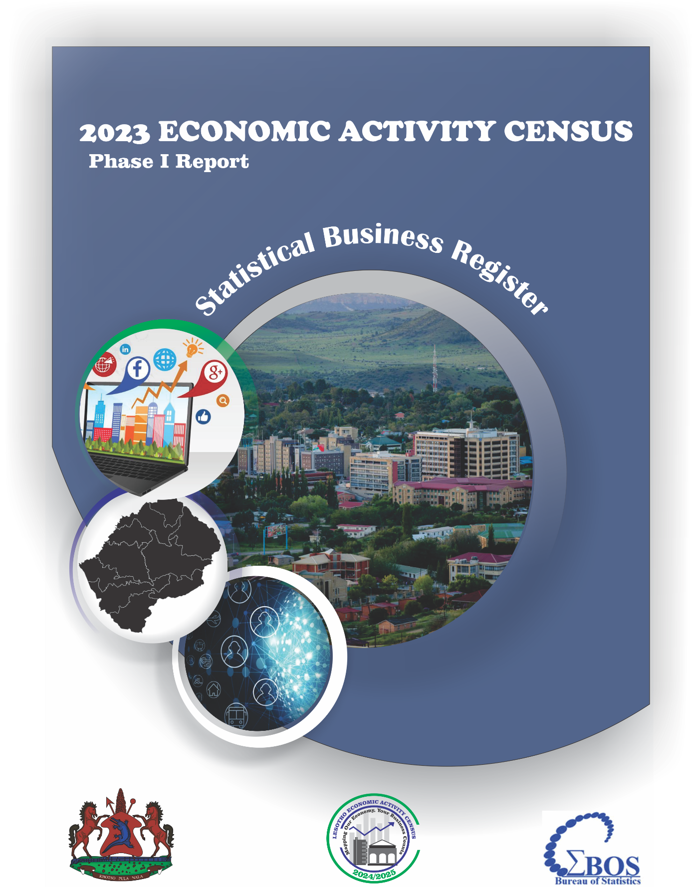

# Preliminary steps

```{r}
#| output: false
#| code-fold: true
#| code-summary: "URL link"
url <- "https://minio.lab.sspcloud.fr/nrandriamanana/BoS/SBR_census.csv"
```

```{r}
#| code-fold: true
#| code-summary: "Import packages"
library(readr)
library(dplyr)
library(tidyr)
library(ggplot2)
```

```{r}
#| output: hide
#| code-fold: true
#| code-summary: "Import csv data"
#| message: false
#| warning: false

# 1. Import data

sbr_data <- read_csv(url)
```

```{r}
#| message: false
#| warning: false
#| echo: false
head(sbr_data)
```

```{r}
#| include: false

## **Distribution of establishments by district-2023**

dist_est_district_2023 <- sbr_data %>%
  filter(`Commencement year` == 2023) %>%
  count(DISTRICT_NAME, name = "n_establishments") %>%
  mutate(
    percentage = round(100 * n_establishments / sum(n_establishments), 2)
  ) %>%
  arrange(desc(n_establishments))
```

```{r}
#| include: false

## **Distribution of establishments by district-all years**

dist_est_district <- sbr_data %>%
  count(DISTRICT_NAME, name = "n_establishments") %>%
  mutate(
    percentage = round(100 * n_establishments / sum(n_establishments), 2)
  ) %>%
  arrange(desc(n_establishments))

```

```{r}
#| include: false

## **Distribution of establishments by district-2023**

dist_est_district_2023 <- sbr_data %>%
  filter(`Commencement year` == 2023) %>%
  count(DISTRICT_NAME, name = "n_establishments") %>%
  mutate(
    percentage = round(100 * n_establishments / sum(n_establishments), 2)
  ) %>%
  arrange(desc(n_establishments))
```

```{r}
#| include: false

## **Distribution of establishments by settlement-2023**

dist_est_settlement <- sbr_data %>%
  #filter(`Commencement year` == 2023) %>%
  count(SETTLEMENT, name = "n_establishments") %>%
  mutate(
    percentage = round(100 * n_establishments / sum(n_establishments), 2)
  ) %>%
  arrange(desc(n_establishments)) %>%
  mutate(residence_type = factor(SETTLEMENT, 
                                 levels = c(1, 2, 3),
                                 labels = c("Urban", "Peri-urban", "Rural")))
```

{fig-align="center"}

# Foreword

# Introduction

## Background

The Bureau of Statistics conducted the Census of Establishments as the first phase of the 2024/2025 Economic Activity Census. This phase, carried out from September 2024, aimed to compile a comprehensive list of all formal enterprises operating in various economic sectors for the 2023 financial year. However, activities related to public administration and the informal sector were excluded from the scope of this census.

The census collected key business data, including economic activity classification, employment distribution by gender, turnover, wages, and salaries. The insights derived from this report will serve as a foundation for updated and reliable economic performance indicators aligned with the National Strategic Development Plan II (NSDP II) extension.

## Objectives

The specific objectives of the EAC were as follows:

- To update and maintain a reliable register of business establishments across the country
- To quantify and classify establishments by number, size, and industrial sector
- To provide detailed employment data disaggregated by sex
- To document business ownership, legal structure, and type of establishment
- To geographically map the distribution of businesses across districts, constituencies, community councils, and villages
- To collect data on turnover and other key financial indicators to assess business performance

# Methodology

# Establishments characteristics

## Distribution of establishments by district

```{r}
#| echo: false
ggplot(dist_est_district, aes(x = reorder(DISTRICT_NAME, n_establishments), y = n_establishments, fill = n_establishments)) +
  geom_bar(stat = "identity", show.legend = FALSE) +
  geom_text(aes(label = paste0(percentage, "%")), 
            hjust = -0.2, 
            size = 3.5, 
            fontface = "bold") +
  coord_flip() +
  scale_fill_viridis_c(option = "mako", direction = -1) +
  scale_y_continuous(expand = expansion(mult = c(0, 0.15))) + # Add space for labels
  labs(
    title = "Distribution of Establishments by District",
    subtitle = "Maseru accounts for over 31% of all establishments",
    x = "District",
    y = "Number of Establishments",
    caption = "Source: BoS Lesotho"
  ) +
  theme_minimal(base_size = 14) +
  theme(
    plot.title = element_text(face = "bold", size = 16),
    panel.grid.minor = element_blank(),
    axis.text.y = element_text(color = "black")
  )
```

The total number of establishments in Lesotho in 2023 were 16154 and the district where most establishment are clustered is Maseru and followed by Leribe and Berea. And the district with least establishments is Quthing.

## Distribution of establishments by settlement

```{r}
#| echo: false
ggplot(dist_est_settlement, aes(x = "", y = n_establishments, fill = residence_type)) +
  geom_bar(stat = "identity", width = 1, color = "white") +
  # Convert to polar coordinates to make it a pie
  coord_polar("y", start = 0) +
  # Add percentage labels directly on the slices
  geom_text(aes(label = paste0(percentage, "%")), 
            position = position_stack(vjust = 0.5), 
            color = "white", 
            fontface = "bold",
            size = 5) +
  # Professional color palette
  scale_fill_manual(values = c("Urban" = "#2c3e50", 
                               "Peri-urban" = "#e67e22", 
                               "Rural" = "#27ae60")) +
  labs(
    title = "Establishment Distribution by Settlement Type",
    subtitle = "Urban areas account for nearly 60% of all establishments",
    fill = "Residence Type",
    caption = "Source: BoS Lesotho"
  ) +
  theme_void() + # Removes background, gridlines, and axes for a clean look
  theme(
    plot.title = element_text(hjust = 0.5, face = "bold", size = 16),
    plot.subtitle = element_text(hjust = 0.5, size = 12),
    legend.position = "bottom"
  )

```


The peri-urban constitute the least of them all with 9.5% of establishments.

# List of tables

## **Distribution of establishments by district-2023**

```{r}
#| echo: false
show_dist_est_district_2023 <- dist_est_district_2023 %>%
  rename("District name"=DISTRICT_NAME,
         "Total"=n_establishments)

show_dist_est_district_2023
```

## **Distribution of establishments by district- all year**

```{r}
#| echo: false
dist_est_district
```

## **Distribution of establishments by settlement-2023**

```{r}
#| echo: false
#dist_est_settlement_2023
```

## **Distribution of establishments by Employment size-2023**

## **Distribution of licenced and non-licensed establishments by district-2023**

## **Distribution of licensed establishments by settlement-2023**

## **Establishment CEOs/Owner and Employees by Sex-2023**

## **Distribution of establishment by Economic Activity-2023**

## **Distribution of establishments by sector and wage groups-2023**

## **Distribution of establishments by Internet Access-2023**
